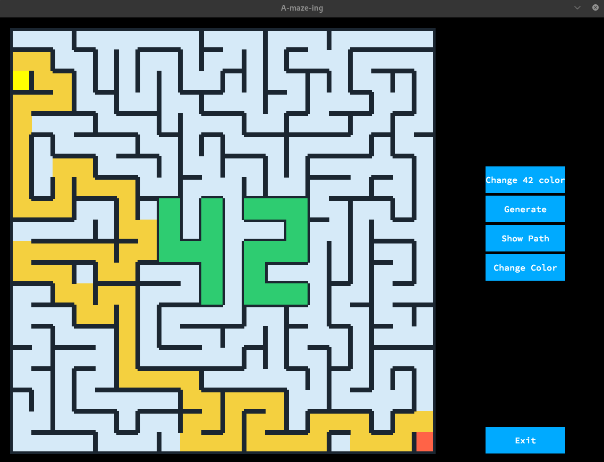

*This project has been created as part of the 42 curriculum by tigondra, mbichet*

# A-Maze-ing

## Description
A-Maze-ing is a Python maze generator configurable via a text file. It allows you to create random or perfect mazes, save them in a hexadecimal format, and display them visually with interactive options.

## Instructions

### Compilation & Installation
To install the necessary dependencies (including the provided MLX wheel) and prepare the environment, run the following command at the root of the repository:
```
make install
```

### Execution
To run the maze generator and visualizer, use:

```
make run
```

Other available Make rules:
```
make lint # Run standard linters on the Python code.
make lint-strict # Run strict linting.
make clean # Clean up temporary files and caches.
make fclean # Perform a full clean, removing the environment/builds.
```

## Configuration File Structure
The project uses `config.txt` to define the parameters of the maze. Based on the core logic, a typical configuration or argument set provides:
* **Width and Height**: Dimensions of the maze (Width: 9-500, Height: 7-400).
* **Entry and Exit**: (x, y) coordinates for the start and end points.
* **Output File**: Path to the generated output (e.g., `output.txt`).
* **Seed**: Optional seed for predictable random generation. If you dont want seed `SEED=None`
* **Perfect Flag**: Boolean to determine if the maze is perfect (no loops) or imperfect.
* **Animated Flag**: Boolean to enable the MLX visual animation.

## Exemple visual



## Maze Generation Algorithm

### Chosen Algorithms
* **Generation**: We implemented a **Depth-First Search (DFS) Backtracker** algorithm to generate the perfect maze. For imperfect mazes, the algorithm first builds a perfect maze and then systematically breaks down additional random walls to create loops.
* **Solving**: We implemented a **Breadth-First Search (BFS)** algorithm to guarantee finding the shortest path between the entry and exit points.

### Why these algorithms?
* **DFS Backtracker** was chosen for generation because it is relatively easy to implement, memory-efficient, and produces mazes with long, winding corridors ("high river factor") which are visually appealing.
* **BFS** was chosen for the solver because it guarantees the shortest path in an unweighted grid, ensuring our solver is completely optimal.

## Reusability
The entire project is built with modularity in mind. All core logic (such as the `Maze` and `Cell` classes) is decoupled from the specific execution scripts. You can easily reuse the maze generation and solving logic in any other Python project by simply importing the modules:

```
from maze_build import Maze
```

This allows other developers to plug our maze engine into their project.

## Team and Project Management

### Roles
`a-mzing.py` : tigondra

`parsing.py` : tigondra + mbichet

`visual.py` : mbichet

`maze_generator.py` : tigondra

`pyproject.toml` : mbichet

`Makefile` : tigondra + mbichet

`Readme.md` : tigondra + mbichet


## Advanced Features
This project includes several advanced features that go beyond a basic maze generator:
* **Animated MLX Visualizer**: Instead of just printing to the terminal, the project uses the `mlx` library to visually animate the solver finding its way through the maze.

## Resources

### References
* https://fr.wikipedia.org/wiki/Mod%C3%A9lisation_math%C3%A9matique_d%27un_labyrinthe
* https://fr.wikipedia.org/wiki/R%C3%A9solution_de_labyrinthe
* MLX Python API Documentation.

### AI Usage
Artificial Intelligence  was used in this project specifically for **documentation purposes**